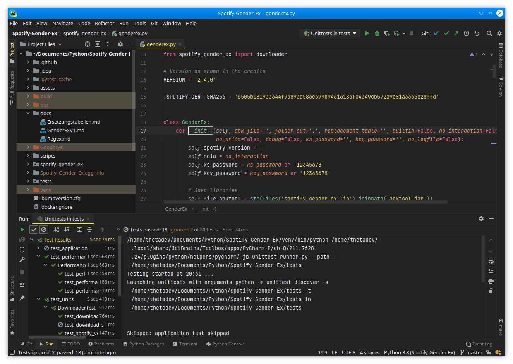
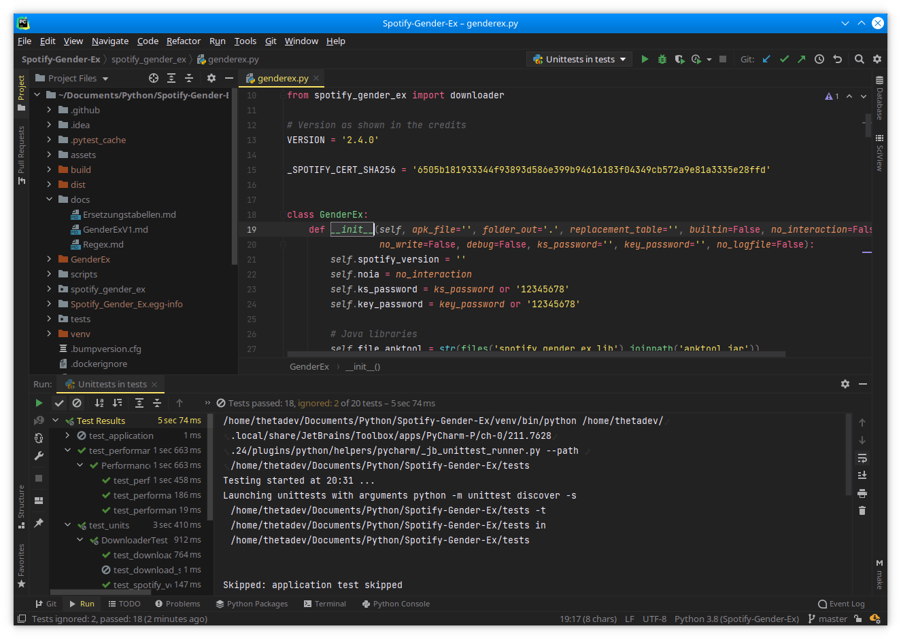

# Monokai Pro HC

The unofficial Monokai Pro theme, originally adapted by [Subtheme](https://subtheme.pro).
This repository includes the default theme and four filters: Machine, Octagon, Ristretto,
and Spectrum.
Credit goes to the original creator: [https://monokai.pro](https://monokai.pro)

Original repository: https://github.com/subtheme-dev/monokai-pro

This fork contains improvements for more contrast and readabliliy,
as well as fixes to the build system.

Most text is now white instad of light gray, the dark gray color for comments became
lighter and the toggleable action icons got a grey border around them to indicate if
they are active.


### How to build

```bash
pip install -r requirements.txt
python build.py .

gradle runIde  # for testing
gradle buildPlugin  # plugin package at build/libs
```


### Screenshots

Monokai Pro HC (Spectrum):


Original Monokai Pro by Subtheme for comparison:



As you can see, filenames and commens are much more readable with the HC version. Also notice the border
around the toggle buttons of the unit test tab.
